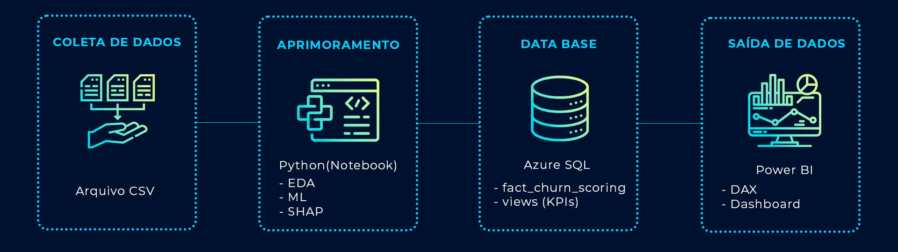
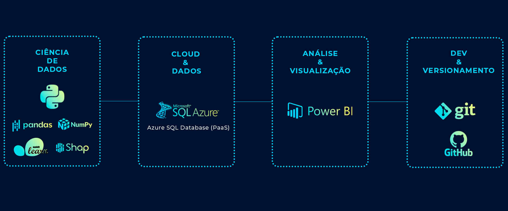

# Churn-Prediction-Portfolio
**End-to-end churn prediction using Machine Learning, Azure SQL Database and Power BI**

Este projeto simula um cenário corporativo real de **retenção de clientes em negócios de assinatura**, combinando **Ciência de Dados**, **Cloud** e **Business Intelligence**.  
O objetivo é **predizer churn**, gerar um **scoring por cliente**, persistir os resultados na **nuvem (Azure SQL)** e disponibilizar insights por meio de um **dashboard executivo (Power BI)**.

## 🎯 Problema de Negócio
Em empresas baseadas em assinatura, o churn impacta diretamente a receita recorrente.  
Este projeto busca responder às seguintes perguntas:

- Quais clientes apresentam **maior probabilidade de cancelamento**?
- Quais fatores estão mais associados ao churn?
- Como **priorizar ações de retenção** com base em risco e impacto financeiro?

> O foco do projeto é **suporte à decisão de negócio**, e não apenas a otimização de métricas técnicas.

## 🧭 Como navegar neste projeto

- 🔍 **EDA e Modelagem**: veja `notebooks/01_churn_analysis.ipynb`
- 🗄️ **Persistência e KPIs**: scripts SQL em `sql/`
- 📊 **Visualização executiva**: detalhes do dashboard em `dashboard/README.md`
- ☁️ **Integração Cloud**: Azure SQL Database como camada de persistência

## 🧠 Abordagem Analítica (End-to-End)

### 1️⃣ Data Science (Python / Notebook)
- Análise Exploratória de Dados (EDA)
  - Avaliação do desbalanceamento do churn
  - Análise de variáveis-chave (tenure, tipo de contrato, cobrança mensal)
- Preparação dos dados
  - Tratamento de valores ausentes
  - Padronização de variáveis
  - Pipeline de pré-processamento (numéricas e categóricas)
- Modelagem preditiva
  - Modelo baseline: **Regressão Logística**
  - Modelo robusto: **Random Forest**
  - Avaliação com métricas adequadas ao desbalanceamento (Recall, ROC-AUC)
- Explicabilidade
  - Importância das variáveis
  - Interpretação global com **SHAP**
 
---

### 2️⃣ Persistência em Cloud (Azure SQL Database)
- Geração do **scoring de churn** por cliente
- Exportação dos resultados via Python
- Persistência no **Azure SQL Database (PaaS)**
- Estruturação de:
  - Tabela fato de scoring
  - Views analíticas (KPIs) para consumo no BI

---

### 3️⃣ Camada Analítica e BI (Power BI)
- Conexão direta com Azure SQL
- Consumo de tabelas e views analíticas
- Construção de dashboard executivo com foco em clareza e ação
- Segmentações estratégicas para análise exploratória

---

## 🧩 Arquitetura da Solução

O projeto foi estruturado em camadas, simulando um fluxo real de apoio à decisão
em um ambiente corporativo, desde a análise dos dados até a visualização executiva.

<p align="center">
  
</p>

## 🛠️Tecnologias Utilizadas

O projeto utiliza um stack moderno de Ciência de Dados, Cloud e BI,
com foco em escalabilidade, interpretabilidade e tomada de decisão.

<p align="center">
  
</p>

## 📁 Estrutura do Repositório

```text
churn-prediction-portfolio/
│
├── assets/
│   ├── architecture.png          # Arquitetura da solução (Data → ML → SQL → BI)
│   └── tech-stack.png            # Stack de tecnologias utilizadas
│
├── notebooks/
│   └── 01_churn_analysis.ipynb   # EDA, feature engineering, modelagem e SHAP
│
├── powerbi/
│   │
│   ├── DAX/
│   │   ├── 01_kpis_general.dax          # KPIs gerais (customers, churn rate)
│   │   ├── 02_kpis_revenue_at_risk.dax  # Receita em risco
│   │   ├── 03_kpis_contract.dax         # Churn por tipo de contrato
│   │   ├── 04_kpis_tenure.dax           # Churn por faixa de tenure
│   │   ├── 05_kpis_payment_method.dax   # Churn por método de pagamento
│   │   └── 06_validations_check.dax     # Medidas de validação (checks SQL vs BI)
│   │
│   ├── Screenshots/
│   │   ├── dashboard_overview.png       # Visão geral do dashboard
│   │   └── kpis_zoom.png                 # Detalhe dos KPIs
│   │
│   └── README.md                  # Explicação do dashboard e métricas
│
├── sql/
│   ├── 01_create_fact_table.sql   # Criação da tabela fato
│   ├── 02_load_data.sql           # Carga dos dados (CSV → Azure SQL)
│   ├── 03_view_scoring_latest.sql # View de scoring mais recente
│   ├── 04_kpis_general.sql        # KPIs gerais
│   ├── 05_kpis_contract.sql       # KPIs por contrato
│   ├── 06_kpis_tenure.sql         # KPIs por tenure
│   ├── 07_kpis_revenue_risk.sql   # KPIs de receita em risco
│   └── 08_high_risk_customers.sql # Clientes de alto risco
│
├── requirements.txt               # Dependências Python
└── README.md                      # Documentação principal do projeto

```

## 📈 Principais Resultados

Identificação clara de clientes com **alto risco de churn**

Forte relação entre churn e:
- Baixo tempo de permanência (**tenure**)
- **Contratos mensais**
- **Maior cobrança mensal**

O modelo **Random Forest** apresentou melhor desempenho em relação ao baseline (Regressão Logística)

O scoring permite **priorizar estratégias de retenção** com base em risco e impacto financeiro

Técnicas de **explicabilidade (SHAP)** transformam previsões em insights acionáveis

<p align="center">
  
</p>

## 🚀 Próximos Passos

- Ajuste de threshold para maximizar recall de churn
- Criação de métricas orientadas à ação (lift, recall@k)
- Versionamento de múltiplas execuções do modelo (histórico de scoring)
- Automatização de refresh e publicação do Power BI

## 🔐 Segurança e Boas Práticas

- Credenciais não são versionadas
- Conexões com Azure SQL via variáveis de ambiente (.env)
- Arquivos sensíveis excluídos do controle de versão
- Estrutura preparada para execução em diferentes ambientes

## Observações

- Dados sensíveis e credenciais não são versionados neste repositório
- Conexões com Azure SQL utilizam variáveis de ambiente
- O CSV de scoring é gerado dinamicamente via notebook

## 👤 Autor

**Matheus Saraiva**  

Projeto desenvolvido para portfólio em Ciência de Dados, com foco em:
- Aplicação prática de Machine Learning
- Integração com Cloud (Azure SQL)
- Visualização executiva com Power BI
- Comunicação clara de insights de negócio

